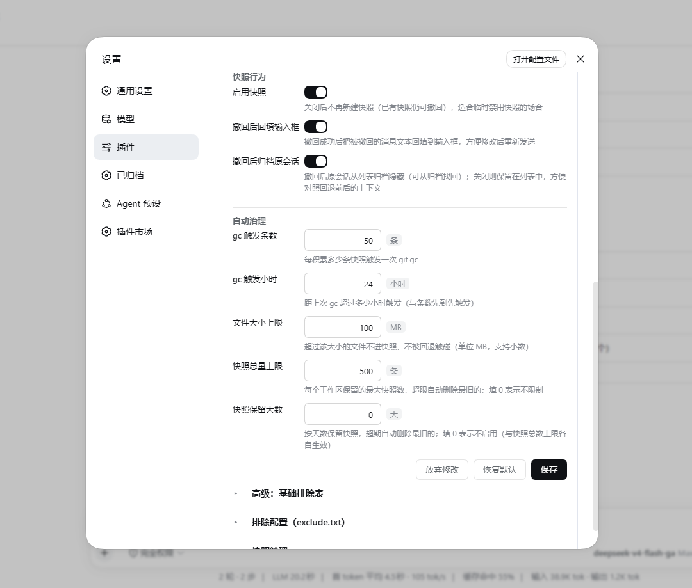

# dsh-recall-plugin

[简体中文](README.md) | English


---
**Under any message you've sent**, **click "↶ Recall"**, **and both your workspace files and the conversation history roll back to the moment right before that message was sent** (DSH 0.1.1-rc.2).
---

[Changelog](CHANGELOG.md)

## UI Preview

- Recall button location


---
| Confirmation panel · file change list | Confirmation panel · rollback scope |
| --- | --- |
|  |  |

- After a recall, the message text is auto-refilled into the input box for quick editing and resending (can be disabled in the settings card)
- Settings · plugin config card (config form / exclusions / snapshot manager, saved changes apply live)



## Highlights

- **Files + conversation, rolled back together**: recalling isn't just about chat history — files the agent modified go back to their original state too.
- **Never touches your project's own git**: snapshots live in an independent shadow git repository; your branches, staging area, and uncommitted changes are untouched. `.git` and `node_modules` are excluded automatically.
- **Keeps your project directory clean**: snapshots always live under `$DSH_HOME`, nothing is ever dropped into your project — regardless of the session's sandbox permission (workspace-write / read-only sessions snapshot and recall as usual). Only when home itself is unwritable (e.g. pointed at a read-only drive) does it fall back to an in-project `.dsh-recall-snapshots` directory (the page shows a notice when degraded); once home is writable again, data migrates back and the fallback directory is cleaned up.
- **Byte-level fidelity** (2.1.1+): snapshots and recalls are immune to your project's `.gitattributes` EOL conversion — LF/CRLF line endings, `$Id$` keywords, and binary content round-trip byte-for-byte (the shadow repository pins `info/attributes` to disable all attribute-driven conversion).
- **Change your mind as many times as you like**: after one recall you can recall again to an even earlier point; files overwritten during a recall always remain recoverable. Up to 500 snapshots per workspace are kept by default (oldest pruned beyond the cap — adjustable or disableable); once a session is permanently deleted, its snapshots are cleaned up accordingly.
- **See the list before you act**: clicking recall first shows the list of files that will change (modified / restored / deleted); nothing is overwritten until you confirm.
- **Busy-agent guard** (2.0+): preview and recall are refused while an agent is running in the target workspace, so files can't change under you mid-confirmation; if a new snapshot has appeared since the preview, execution forces a fresh preview (staleness check).
- **Auto-rescue on rollback failure** (2.1+): a "pre-rollback" safety snapshot is taken before every recall; if the rollback fails midway, the workspace is automatically restored to its pre-rollback state — and if the rescue itself fails, you get a copy-paste-ready manual recovery command. No path ever leaves a half-rolled-back workspace behind.
- **Disk-friendly**: snapshots use git delta compression — incremental, not full-directory copies. Files larger than 100MB are skipped automatically (the threshold is configurable in the settings card).
- **Automatic housekeeping**: periodic `git gc` packs loose objects (lossless — not a single snapshot is lost); snapshots of deleted sessions are cleaned up automatically; optional cleanup by snapshot cap and by retention age (both configurable); build artifacts can be excluded globally via `exclude.txt` (see below).
- **Failures speak up**: snapshot failures are classified by root cause (git missing / disk full / permission denied / lock conflict / directory conflict) with actionable guidance, surfaced as a toast at the top of the page (the same fault only bothers you once per 10 minutes, adjacent repeats merged with a count) — nothing fails silently; the failure reason lands in the "Recent errors" section of the settings card.
- **Self-healing on failure**: after a snapshot fails, leftover objects are pruned automatically; 3 consecutive failures trigger an exponential-backoff circuit breaker (auto-retry after the cooldown); the failure path also sweeps stray git processes and stale locks — concurrent instances yield to each other via heartbeats instead of wedging each other (2.1+), and the disk never bloats from failed retries.
- **Unindexable paths are skipped, not fatal**: embedded git repositories, unreadable files, and other paths that can't be indexed no longer fail the whole snapshot — the snapshot is still taken, and skipped paths are reported via toast (on recall they are neither restored nor deleted, same semantics as exclusions).
- **Tree-view snapshot manager**: the "Snapshot Manager" on the settings page shows a **workspace → session → snapshot** three-level tree with expand/collapse and search support; sessions produced by recalls are grouped into "version families" (v1/v2/v3) along the fork chain. Each level has a delete button on its right, so you can clear all snapshots of a workspace or a session at once. Leaves show a summary of the message content the snapshot corresponds to, making it easy to locate "what this message changed back then".

## Known Limitations

- Snapshots are created **when a message is sent**; messages from before the plugin was enabled have no snapshot and show no recall button.
- The first user message of a session cannot roll back the conversation (files only), because fork requires an earlier turn boundary.
- Recall cannot be initiated while an agent is running in the target workspace (by design — stop the agent first).
- Supports Windows (PowerShell 5.1/7 + git CLI) and Linux/macOS (bash + git CLI). Windows is thoroughly verified on real machines; Linux has been fully tested on WSL2 (Ubuntu 26.04, bash 5.3 + git 2.53), including Chinese paths, home fallback, session cleanup, and gc; the macOS side is written to be bash 3.2 compatible but has not been tested on real hardware yet.
- Nested git repositories inside the workspace (subdirectories with their own `.git`) cannot be indexed: the snapshot proceeds for everything else (fail-open, with a toast listing the skipped paths), but their contents do not participate in recalls.
- Extreme cases like filenames containing newlines/TAB are beyond the diff list's parsing capability (negligible probability).
- **Interplay with dsh-routing-suite (progressive tool-disclosure router)**: if you also run the router-standard preset, a recall forks a new session via `sessions.fork`, which resets the router's stage to its default (the tool surface temporarily narrows). Symptoms, root cause and the fix are documented in [docs/routing-interplay.md](docs/routing-interplay.md) (Chinese).

## Installation

Prerequisites: git CLI (without it the recall button won't appear and a notice shows at the top of the page — DSH itself keeps running); PowerShell 5.1 / 7 on Windows, bash + git on Linux/macOS; DSH 0.1.1-rc.x (see `peerDependencies` for dependency versions).

- Official DSH plugin command: install and auto-mount into the web profile
```powershell
dsh plugin --profile web add dsh-recall-plugin
```
- Or install directly from git:
```powershell
dsh plugin --profile web add github:limbo947/dsh-recall-plugin
```
- Restart the DSH process (pick whichever matches how you start it)
```powershell
dsh web                      # run in the foreground
pm2 restart <your-dsh-name>  # if managed by pm2
```

**Verify**: after restarting, hard-refresh the page (Ctrl+Shift+R) and hover over any user message sent after the plugin was enabled — the "↶" appearing next to the copy button means it works. No button? Nine times out of ten the DSH process wasn't restarted, or git CLI isn't on PATH.

**Uninstall**: `dsh plugin --profile web remove dsh-recall-plugin` (removes both the dependency and the mount layer). Snapshot data is kept under `dsh-recall-snapshots/` in home; delete that directory manually if you want it fully gone.

## Usage

1. Hover over any user message sent **after the plugin was enabled** (including steering messages inserted while the agent is running) — "↶ Recall" appears to the left of the copy button.
2. Click it → the confirmation panel shows the list of files that will change (modified / restored / deleted).
3. Click "Confirm rollback" → files are restored to their state before that message was sent; the view switches to a new session (that message and everything after it is removed), while the original session is archived and can be recovered anytime.

## Configuration

All options can be edited visually in the "**Settings → Plugin Config → Recall Plugin**" card (saved changes apply live, no restart needed), or by restating the insert line under `id: recall` in the profile's `cordis.patch.yml`. Environment variables only override the two gc options and take top priority (fields locked by env are marked and uneditable in the card).

| Option | Default | Description |
| --- | --- | --- |
| `gcSnaps` | 50 | Run `git gc` after this many snapshots accumulate (env `DSH_RECALL_GC_SNAPS` force-overrides) |
| `gcHours` | 24 | Run gc when this many hours have passed since the last one (whichever trigger fires first; env `DSH_RECALL_GC_HOURS`) |
| `maxFileBytes` | 104857600 (100MB) | Files larger than this are neither snapshotted nor touched by recalls |
| `maxSnapshotsPerWorkspace` | 500 | Maximum snapshots kept per workspace; oldest pruned beyond the cap. 0 = unlimited |
| `retentionDays` | 0 | Keep snapshots for this many days; older ones are deleted. 0 = disabled (works independently of the cap) |
| `baseExcludes` | `.git`, `node_modules/`, `.dsh-recall-snapshots/`, `dsh-recall-snapshots/` | Base exclusion list (gitignore syntax, lower priority than exclude.txt) |
| `refillDraft` | true | Refill the recalled message text into the input box after a recall |
| `snapshotEnabled` | true | Master snapshot switch (off = no new snapshots; existing snapshots remain recallable) |
| `archiveOriginal` | true | Archive the original session after a recall (off = the original session stays in the session list) |

The settings card also offers "Restore defaults" (one-click reset of all fields) and a "Recent errors" viewer/clearer.

## Snapshot Maintenance & Cleanup

The plugin manages disk usage automatically — no manual housekeeping needed:

- **Periodic gc**: every 50 snapshots or 24 hours since the last gc (whichever comes first, thresholds configurable), `git gc` runs in the background to pack loose objects. This is lossless — every snapshot remains recallable. The throttle token lives in `gc.stamp` inside the shadow repository, so restarting DSH does not reset the cycle.
- **Cap & retention**: up to 500 snapshots per workspace by default (oldest pruned beyond the cap); optionally set `retentionDays` for age-based retention. The two triggers work independently and can both be adjusted or disabled in the config card.
- **Session-deletion cleanup**: once a session is permanently deleted (its log gone from disk), the next maintenance pass automatically removes all of its snapshots and frees the space. **Archiving is not deletion** — logs of sessions archived by the recall feature itself still exist, so their snapshots are kept and recoverable from the archive. The check is conservative: a session that is merely cold (not in memory) is never cleaned, and when the log's state cannot be verified, it is left alone.
- **User-defined exclusions**: open the "**Settings → Plugin Config → Recall Plugin**" card (collapsed by default; click the header to expand) to edit snapshot exclusions visually — type a path or pattern and press Enter to add it, one-click append for common patterns (`dist/`, `*.log`, `.env`, …), and saved changes take effect on the very next snapshot/recall, no restart needed. Alternatively, edit `dsh-recall-snapshots/exclude.txt` under home directly (i.e. `$DSH_HOME/dsh-recall-snapshots/exclude.txt`, or `~/.dsh/dsh-recall-snapshots/exclude.txt` when unset; UTF-8; one gitignore-style pattern per line; lines starting with `#` are comments) — both paths edit the same configuration, for example:

  ```gitignore
  # keep build artifacts out of snapshots
  dist/
  build/
  *.log
  ```

  This applies to all projects (when home is unwritable and a workspace falls back to in-project storage, it gets its own independent exclusion config, listed as a separate card in the settings tab). New exclusions only affect future snapshots; **when recalling to an earlier snapshot, files that weren't excluded at that time are still restored** (returning to the state as it was — that's exactly what recall means). To fully purge a directory that already made it into snapshots, manually delete the corresponding hash directory under `dsh-recall-snapshots/` in home.
- **Tree-view snapshot manager**: open "**Settings → Plugin Config → Recall Plugin → Snapshot Manager**" to see the tree list — first level workspace (folder name), second level session (session title, recall chains grouped into version families), third level snapshot (time + message content summary, hover for the full content). Search and "load more" are supported; workspace and session nodes expand/collapse; every level has a delete button on its right, with a confirmation before deletion. Deleting a workspace = clearing all snapshots of that workspace; deleting a session = clearing all snapshots of that session within that workspace; deleting a leaf = removing just that single snapshot; a confirmed "Delete all" button sits at the top.

## How It Works

When each user message is sent (before the agent touches any files), the workspace is snapshotted into an independent shadow git repository; on recall, a "pre-rollback" safety snapshot is taken first, then files are restored via `git archive` and the conversation is rewound through DSH's official `sessions.fork` mechanism. Binary- and line-ending-safe, and your project's own git state is never touched.

- Snapshot storage: `dsh-recall-snapshots/<SHA256(project absolute path)>/` under home, containing the shadow git repository (`git/`, tags named `snap-<messageID>`), the index file `index.json` (message ID → snapshot time / session), and the recall chain `lineage.json`. Scripts run via PowerShell on Windows and bash on Linux/macOS (selected automatically by platform).
- To browse historical snapshots directly:

  ```powershell
  git --git-dir="<store>\git\.git" tag -l
  git --git-dir="<store>\git\.git" ls-tree -r --name-only snap-<messageID>
  ```

## Local Development (without publishing)

Point the profile's dependency for this package at your clone via `link:`; DSH loads the built `lib/` artifacts from the workspace (source lives in `src/`), so run `npm run build` after editing `src/`, then restart DSH — no copying or publishing needed:

```powershell
# 1. Edit $env:USERPROFILE\.dsh\profiles\web\package.json:
#    in "dependencies", set "dsh-recall-plugin": "link:<path-to-your-clone>\dsh-recall-plugin"
#    "dsh.profile.bundles" should already contain "dsh-recall-plugin" (run the official install command once)
# 2. Install in the profile directory and restart
cd $env:USERPROFILE\.dsh\profiles\web
pnpm install
# 3. Restart DSH and hard-refresh the page (Ctrl+Shift+R)
```

Note: all source lives in `src/` (host in `src/host/`, browser side in `src/client/`, shared types in `src/types/`); `lib/` is a pure build-output directory — `npm run build` generates it via esbuild (per-file host transpilation plus the `lib/client.js` bundle), and the artifacts are committed with the source. **You must run `npm run build` after changing any `src/` file**, otherwise the stale artifacts keep running (CI enforces artifact freshness).

### Tests

- `npm test`: pure-logic unit tests (vitest, 17 files / 227 cases, no DSH dependency, runs identically in CI and locally) — config parsing, snapshot parsers, rescue orchestration, error classification, script-template same-name-export contract, client pure functions, published-package layout, snapshot index persistence, storage caps and retention, etc.;
- `npm run test:probe`: official-API field probes (requires a local dsh installation; **must run after any dsh upgrade**) — pins fields like `renderMessageImages`/`node`/`cwd`, `atSeq`/`increaseTitle` of `sessions.fork`, `listSessions` record shape, `AgentRegistry`, and goes red on violation;
- `npm run verify:host`: assembly gate (requires a local dsh installation) — boots the plugin with a real cordis context, asserting inject declarations, endpoint registration, Config schema, and teardown cleanliness, catching assembly regressions before release;
- `npm run build`: full host+client build (mandatory after any `src/` change); `npm run check:dsh`: dsh version inspection (pre-release).
- CI (GitHub Actions) runs `npm ci --legacy-peer-deps` + `npm run typecheck` + `npm test` + unified artifact-freshness check (`npm run build && git diff --exit-code lib/`; probes and the assembly gate only run on machines with dsh).

## License

MIT
