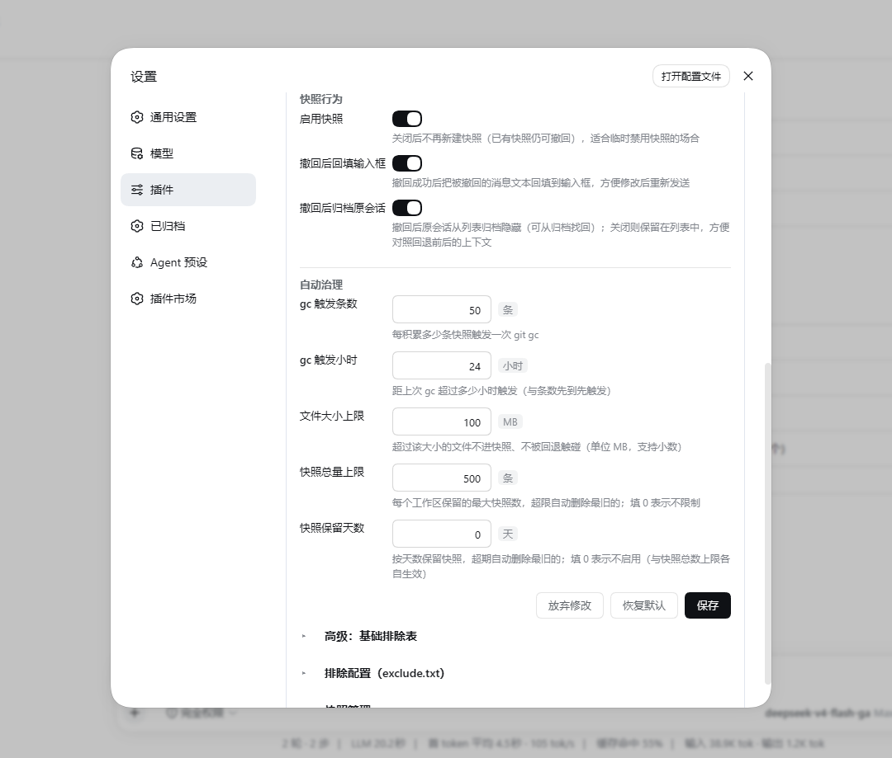

# dsh-recall-plugin [](https://awesome-dsh-plugin.com/zh/p/limbo947/dsh-recall-plugin/)

简体中文 | [English](README.en.md)

[](https://www.npmjs.com/package/dsh-recall-plugin)
[](https://www.npmjs.com/package/dsh-recall-plugin)

[](https://github.com/deepseek-ai/deepseek-harness/releases/tag/dsh-v0.2.1-alpha.2)

在任意一条你发过的消息下方点「↶ 撤回」——**工作区文件和对话历史一起回到那条消息发出之前的状态**。

每条消息发送时，工作区先被快照进一个独立的影子 git 仓库（不碰项目自身的 git）；撤回时按快照恢复文件，并经 DSH 官方 `sessions.fork` 把对话切回该消息之前的 turn 边界，原会话归档保留、随时可找回。被撤回消息的文本与附件自动放回输入框，改完即可重发。快照存储默认落在 `$DSH_HOME` 下。最主要的边界：快照只在**消息发送时**创建，插件启用前的历史消息没有快照、不显示撤回按钮。

[更新日志](CHANGELOG.md)

## 目录

- [界面预览](#界面预览)
- [功能亮点](#功能亮点)
- [已知限制](#已知限制)
- [安装](#安装)
- [使用](#使用)
- [配置项](#配置项)
- [快照维护与清理](#快照维护与清理)
- [工作原理](#工作原理)
- [事件契约（供同宿主插件监听）](#事件契约供同宿主插件监听)
- [本地开发（无需发布）](#本地开发无需发布)
- [License](#license)

## 界面预览

| 撤回按钮 | 确认面板 · 变更文件清单 |
| --- | --- |
|  |  |

- 设置页 · 插件配置卡片（配置表单 / 排除表 / 快照管理，保存即热生效）



## 功能亮点

带括号版本号的能力需要该版本或更高；其余无特殊版本要求。

- **文件 + 对话，整段回退**：撤回的不只是聊天记录，agent 改过的文件也一并回到原样；不受项目 `.gitattributes` 转换影响，换行与二进制内容字节级保真（2.1.1+）。
- **只想重来对话？文件可以不动**（2.3.24+）：确认面板可二选一撤回范围——默认「回退文件与对话」为完整回退；「仅撤回对话」则项目文件一个字节都不动（也不打安全快照），适合对回复不满意、但文件改动正是想要内容的场景。
- **不碰项目自身的 git，目录保持干净**：快照存在独立的影子 git 仓库，分支、暂存区、未提交改动统统不受影响；存储默认落在 `$DSH_HOME` 下、与会话沙箱权限无关（workspace-write / read-only 照常工作），仅当 home 不可写才降级到项目内 `.dsh-recall-snapshots`。
- **先看清单再动手，可反复后悔**：撤回前展示将变更的文件清单（修改 / 恢复 / 删除），确认后才执行；撤回后还能再撤到更早，被覆盖的文件一直找得回来。
- **撤回完就能重发**（2.3.15+）：消息的文本与附件（图片、文件）一起放回输入框，改完直接发送，不必重新挑一遍附件。
- **撤回全程有防护**（2.0+，救援 2.1+）：预览后出现新快照会强制重新预览；执行前自动打「回退前」安全快照，回退失败自动救援，救援失败给出可直接复制执行的手动恢复命令。
- **磁盘友好、自动维护**：快照走 git delta 增量压缩，大文件自动跳过（阈值可配）；定期无损 `git gc`、会话删除联动清理、按条数与保留天数自动清理；设置页提供**工作区 → 会话 → 快照**三级树形管理，支持搜索与分级删除。
- **失败不静默、能自愈**（自愈 2.1+）：失败按根因分类（git 缺失 / 磁盘满 / 无权限 / 锁冲突 / 目录冲突）给出可行动提示，同类故障 10 分钟只打扰一次，原因进设置卡片「最近错误」；自动清理残骸、连续 3 次失败指数退避、多实例按心跳互让；无法索引的路径跳过并告知，不中断整条快照（撤回时也不触碰它们）。

## 已知限制

设计上接受的边界与尚未覆盖的极端情形，使用前值得先确认。

- 快照在**消息发送时**创建：插件启用前的历史消息没有快照，不显示撤回按钮。
- 快照是**尽力捕获**：从收到消息到 `git add` 之间有约 0.5–1.5 秒窗口（Windows 上仅一次 PowerShell 启动就占约 0.4 秒）。秒级任务若在这个窗口内改完文件，该快照会连带捕获本轮改动——撤回时文件回退成为空操作（预览面板显示「共 0 个文件将变更」），对话回退不受影响。
- 会话第一条用户消息无法回退对话（仅文件回退），因为 fork 需要更早的 turn 边界。
- 目标工作区的 agent 正在运行时无法发起撤回（防护设计，先停止 agent 再撤回）。
- 支持 Windows（PowerShell 5.1/7 + git CLI）与 Linux/macOS（bash + git CLI）。Windows 真机验证充分；Linux 已在 WSL2（Ubuntu 26.04，bash 5.3 + git 2.53）实测全流程（含中文路径、home 降级、会话清理、gc）；macOS 侧脚本按 bash 3.2 兼容编写，尚未真机实测。
- 工作区内嵌套的其他 git 仓库（子目录自带 `.git`）无法索引：其余部分快照照常（fail-open，页面会提示跳过了哪些路径），但其内容不参与回退。
- 工作区内的**目录重解析点**（junction / 目录符号链接）默认不参与快照：它们指向的子树不会被索引，因此那部分内容不参与回退。win32 上这是必需的——git for Windows 把 junction 当普通目录递归，自引用 junction 会让索引膨胀到 Windows 的 31 层重解析点上限（实测 2 个文件的工作区产出 64 条索引）；POSIX 侧符号链接照常进快照（git 记成 `120000` 条目，不递归进目标）。确需把某个**良性** junction（指向工作区外、非自引用）纳入快照时，可在排除配置里追加 `!路径/`（如 `!ext-link/`）反选恢复——用户排除行在机器生成行之后生效；**切勿对自引用 junction 使用**（爆炸根因）。
- 文件名含换行/TAB 的极端情形超出 diff 清单的解析能力（概率可忽略）。
- **与 dsh-routing-suite（渐进式工具披露路由）的交互**：同时启用其 router-standard 预设时，撤回经 `sessions.fork` 出新会话会把路由阶段重置为默认（工具面临时收窄）。现象、成因与解决方案见 [docs/routing-interplay.md](docs/routing-interplay.md)。

## 安装

前置：

- git CLI：未安装时撤回按钮不出现（页面顶部会提示安装 git），不影响 DSH 运行。
- shell：Windows 上 PowerShell 5.1 / 7 均可；Linux/macOS 需 bash。
- DSH 版本：`0.1.2-alpha.1` 至 `0.2.1-alpha.2`；已核验 minor 线内的后续版本自动放行，未核验的新 minor 线会被启动期兼容门禁拦截（开窗机制见下方折叠块）。
- **0.1.7-alpha.1 是破坏性版本**（shell 执行与 settings 面接口更换），插件内置双分支共存适配：同一发布同时兼容 0.1.2–0.1.6 各线与 0.1.7+，老版本 DSH 上行为不变。
- `0.1.1-rc.2` 及更早不支持：那条线的客户端运行时没有 `sessions`/`workspaces`/`uiWorkspace` 服务，插件 UI 会静默不渲染。

<details>
<summary>peer 版本开窗机制（升级 dsh 前可看）</summary>

peerDependencies 按 minor 版本线开窗，与 `dsh.compatibility.dshReleases` 声明一致：

```
>=0.1.2-alpha.1 <0.1.3 || >=0.1.3-alpha.1 <0.1.4 || >=0.1.5-alpha.1 <0.1.6 || >=0.1.6-alpha.1 <0.1.7 || >=0.1.7-alpha.1 <0.1.8 || >=0.2.0-rc.1 <0.2.1 || >=0.2.1-alpha.1 <0.3.0
```

每条线以首个核验版本为下限、上界开到下一 minor（0.2.1 段上限放宽到 `<0.3.0`，0.2 全线正式版自动放行），同线内后续 prerelease/正式版自动放行、无需改 peer 声明。0.2.0 与 0.2.1 两线都必须显式开窗：npm 的 prerelease 门槛要求同 tuple 且带 prerelease 的比较器，既有 `<0.1.8` 段放行不了 `0.2.0-rc.1`、`<0.2.1` 段放行不了 `0.2.1-alpha.1`（0.2.2 及以后 tuple 的 prerelease 同样受此门槛约束，待核验后另加段）。

</details>

安装与验证：

- 官方命令安装（按所用前端选 profile），安装后自动挂载进该 profile：

  ```powershell
  dsh plugin --profile web add dsh-recall-plugin      # Web UI
  dsh plugin --profile desktop add dsh-recall-plugin  # Desktop
  ```

- 也可从 git 直接安装：

  ```powershell
  dsh plugin --profile web add github:limbo947/dsh-recall-plugin
  ```

- 重启 DSH 进程（按你的启动方式选择）：

  ```powershell
  dsh web                      # 前台运行
  pm2 restart <你的-dsh-名称>  # pm2 托管时
  ```

- 验证：重启后硬刷新页面（Ctrl+Shift+R），悬停任意一条插件启用后发送的用户消息——复制按钮旁出现「↶」即生效。没有按钮？九成是没重启 DSH 进程，或 git CLI 不在 PATH 里。
- 卸载（同时移除依赖与挂载）：

  ```powershell
  dsh plugin --profile web remove dsh-recall-plugin
  ```

  快照数据保留在 home 下 `dsh-recall-snapshots/`，想彻底清除手动删掉该目录即可。

## 使用

对一条插件启用后发送的用户消息做完整撤回，流程如下：

1. 鼠标悬停该消息（含 agent 运行中插入的转向指令消息），复制按钮左侧出现「↶ 撤回」。
2. 点击 → 确认面板展示将变更的文件清单（修改 / 恢复 / 删除），并可选撤回范围：「回退文件与对话」（默认）或「仅撤回对话」（文件保持当前状态）。
3. 点「确认回退」（或「确认撤回对话」）→ 文件恢复到该消息发送前的状态（仅撤回对话时文件不动）；视图切到新会话（该消息及之后的对话移除），原会话归档、随时可找回。

## 配置项

全部配置可在「**设置 → 插件配置 → 撤回插件**」卡片可视化修改（保存即热生效，无需重启），也可在 profile 的 `cordis.patch.yml` 按 `id: recall` 重述 insert 行改写；env 变量仅覆盖 gc 两项且优先级最高（设了 env 的字段在卡片里锁定）。

| 配置项 | 默认值 | 说明 |
| --- | --- | --- |
| `gcSnaps` | 50 | 每积累多少条快照触发一次 `git gc`（env `DSH_RECALL_GC_SNAPS` 可强制覆盖） |
| `gcHours` | 24 | 距上次 gc 超过多少小时触发（与条数先到先触发；env `DSH_RECALL_GC_HOURS`） |
| `maxFileBytes` | 104857600（100MB） | 超过该大小的文件不进快照、不被回退触碰 |
| `maxSnapshotsPerWorkspace` | 500 | 每个工作区保留的最大快照数，超限自动删除最旧的；0 = 不限制 |
| `retentionDays` | 0 | 按天数保留快照，超期自动删除；0 = 不启用（与条数上限各自独立生效） |
| `baseExcludes` | `.git`、`node_modules/`、`.dsh-recall-snapshots/`、`dsh-recall-snapshots/`、`target/`、`dist/`、`build/`、`out/`、`coverage/`、`.next/`、`.nuxt/`、`.output/`、`.cache/`、`.gradle/`、`*.exe`、`*.dll`、`*.pdb`、`*.so`、`*.dylib`、`*.msi`、`*.zip`、`*.7z`、`*.rar`、`*.tar`、`*.tar.gz`、`*.iso` | 基础排除表（gitignore 语法，优先级低于 exclude.txt）；被排除的大目录整棵子树不进快照扫描。其中「目录形态」项（如 `target/`）另有一层含义：**工作区根自身的路径段命中时，该工作区不启用快照**——在构建产物目录里开会话时排除表本来就管不到它自己（模式是相对该 root 的），这类目录也没有回退价值；删掉对应项即恢复 |
| `refillDraft` | true | 撤回后把被撤回的消息（文本与附件）回填到输入框 |
| `snapshotEnabled` | true | 快照总开关（关闭只冻结新建，已有快照仍可撤回） |
| `archiveOriginal` | true | 撤回后归档原会话（关闭后原会话保留在会话列表中） |
| `locale` | auto | 界面语言：`auto` 跟随系统（`navigator.language` 以 `zh` 开头用中文，否则英文）、`zh` / `en` 显式锁定。见下方「界面语言」 |

设置卡片另提供「恢复默认」（一键重置全部字段）与「最近错误」查看/清空。

### 界面语言

插件自绘的界面（撤回按钮与确认面板、toast 提示、设置卡片三张卡、快照管理树、最近错误）全部双语，由 `locale` 控制：在配置卡片的「界面」分组下拉切换、保存即生效（设置页立刻切换；聊天页的会话文案在下次刷新页面后跟进）。

两项明示限制：① 宿主官方设置表单自己渲染的字段说明（即 `Schema.description()` 文本）仍是中文，插件无法本地化——插件自绘的配置卡片不受影响；② 带动态细节的宿主侧错误（回退失败的救援结果、具体校验失败原因、原始异常文本）在错误面板与「最近错误」里原样展示宿主返回的中文/英文原文，不套本地化短句——宁可中英混排，也不吞掉排障需要的细节。

## 快照维护与清理

插件自动控制磁盘占用，无需手动管理：

- **定期 gc**：每 50 条快照或距上次 gc 24 小时（先到先触发，阈值可配），后台执行 `git gc` 把 loose 对象压成 pack——无损操作，所有快照照常可回退。节流凭据写在影子仓库内的 `gc.stamp`，重启 DSH 不会重置周期。
- **条数上限与保留天数**：每工作区默认上限 500 条（超限清最旧），`retentionDays` 按保留天数清理；两者独立触发，都可在配置卡片调整或关闭。
- **会话删除联动清理**：会话被彻底删除（会话日志从磁盘消失）后，下一次维护会自动删除该会话的全部快照并释放空间。**归档不算删除**——撤回功能归档的原会话日志仍在，快照保留、随时可从归档找回。判断很保守：会话只是冷着（不在内存）不会误清；无法核实日志状态时宁可不清。
- **用户自定义排除**：打开「**设置 → 插件配置 → 撤回插件**」卡片（默认收起，点卡片头展开）即可可视化编辑快照排除项——输入路径或模式回车即加、常用模式（`dist/`、`*.log`、`.env` 等）一键追加、保存后下一次快照/回退立即生效，无需重启。也可以直接编辑 `$DSH_HOME/dsh-recall-snapshots/exclude.txt`（未设置时为 `~/.dsh/dsh-recall-snapshots/exclude.txt`；UTF-8）：一行一条 gitignore 风格 pattern（`#` 开头为注释），两种方式编辑的是同一份配置。例如：

  ```gitignore
  # 构建产物不进快照
  dist/
  build/
  *.log
  ```

  对所有项目生效（home 不可写而降级到项目内存储时，该工作区有独立的排除配置，设置页会分卡片列出）。新增排除只影响之后的快照；**回退到更早的快照时，当时尚未排除的文件仍会被恢复**（回到当时的状态，这正是回退语义）。想彻底清掉已进快照的目录，可手动删除 home 下 `dsh-recall-snapshots/` 里对应项目的哈希目录。
- **树形快照管理**：打开「**设置 → 插件配置 → 撤回插件 → 快照管理**」可看到三级树——工作区（文件夹名）→ 会话（会话标题，撤回链聚成版本家族）→ 快照（时间 + 消息内容摘要，悬停看完整内容）。支持搜索与「加载更多」，工作区与会话节点可展开/折叠；每一级右侧都有删除按钮，删除前二次确认——删工作区 = 清掉该工作区全部快照，删会话 = 清掉该会话全部快照，删叶子 = 只删那一条；顶部另有带确认的「全部删除」。

## 工作原理

每条用户消息发送时（agent 动文件之前），工作区被快照进一个独立的影子 git 仓库；撤回时先打「回退前」安全快照、再用 `git archive` 恢复文件、通过 DSH 官方 `sessions.fork` 机制把会话切到该消息之前。二进制与换行符安全，全程不触碰项目自身的 git 状态。

- 快照存储：home 下 `dsh-recall-snapshots/<SHA256(项目绝对路径)>/`，内含影子 git 仓库（`git/`，tag 名为 `snap-<消息ID>`）、索引文件 `index.json`（消息 ID → 快照时间 / 会话）与撤回链 `lineage.json`。Windows 上脚本走 PowerShell，Linux/macOS 走 bash（按平台自动分叉）。
- **Windows 上宿主把 shell 配成 bash 也照常工作**（2.3.22+）：官方 shell 由 profile 注册，win32 上可以只启用 `bash-sandbox`——此时 pwsh 脚本会被 bash 执行而全盘失败。插件首次执行命令前会先探测执行器能否跑 pwsh（哨兵命令），确认是 bash 后改用系统 PowerShell 5.1 直连执行，快照与撤回不受影响；`ctx.shell` 即 pwsh 的常规部署行为不变（探测一次、判为 pwsh 后一切照旧）。
- 想直接翻历史快照：

  ```powershell
  git --git-dir="<store>\git\.git" tag -l
  git --git-dir="<store>\git\.git" ls-tree -r --name-only snap-<消息ID>
  ```

- 存储目录里每个文件（索引、撤回链、格式标记、意图记录等）的格式与版本兼容约定见 [docs/format.md](docs/format.md)。

## 事件契约（供同宿主插件监听）

撤回到达终态时，插件经 cordis 事件广播两个公开事件（2.4.8+），同宿主任意插件可直接监听——例如长时记忆插件据此清理「被撤回回合」写入的记忆：

```js
// 同宿主插件内
ctx.on('dsh-recall/complete', (e) => {
  if (e.chatReverted) memory.purgeTurn(e.root, e.sessionId, e.cutSeq)
})
ctx.on('dsh-recall/failed', (e) => {
  if (e.stage === 'fork') log.warn('文件已回退但对话未回退', e)
})
```

`dsh-recall/complete`——撤回成功终态：

| 字段 | 类型 | 说明 |
| --- | --- | --- |
| `version` | `1` | 契约版本（演进规则见下） |
| `sessionId` | `string` | 被撤回的原会话 |
| `childSessionId` | `string \| null` | fork 出的新会话；纯文件回退时为 `null` |
| `scope` | `'both' \| 'session-only'` | 撤回范围 |
| `cutSeq` | `number \| null` | 对话回退切点；该消息是会话首条时为 `null` |
| `messageId` | `string` | 被撤回消息 ID（快照主键） |
| `root` | `string \| null` | 工作区根路径；host 解析失败为 `null` |
| `count` | `number` | 回退文件数（`session-only` 恒 `0`） |
| `chatReverted` | `boolean` | 对话是否真的回退（下游清理判据，见下） |
| `archiveRequested` | `boolean` | 原会话归档是否已发起（fire-and-forget，不代表已落定） |
| `time` | `number` | host 收到上报的时间（ms） |

`dsh-recall/failed`——撤回失败终态：

| 字段 | 类型 | 说明 |
| --- | --- | --- |
| `version` | `1` | 契约版本 |
| `stage` | `'execute' \| 'fork'` | 失败阶段：文件回退被拒/异常，或文件已回退但对话回退失败 |
| `sessionId` | `string \| null` | 被撤回的原会话 |
| `messageId` | `string` | 被撤回消息 ID |
| `scope` | `'both' \| 'session-only'` | 撤回范围 |
| `cutSeq` | `number \| null` | client 已知的对话切点（可能尚未使用） |
| `root` | `string \| null` | 工作区根路径；解析失败为 `null` |
| `code` | `string?` | 仅 `stage='execute'`：透传 host 错误码（`AGENT_BUSY` / `NO_SNAPSHOT` 等） |
| `error` | `string` | 错误描述 |
| `time` | `number` | host 收到上报的时间（ms） |

语义要点（下游必读）：

- **只有终态才发事件**。撤回确认后「预览已过期、自动重新拉清单」（STALE）是中间态，不发任何事件；用户取消、面板关闭同样不发。
- **fork 失败只发 `failed(stage:'fork')`，绝不发 `complete`**——此刻文件已回退但对话未回退，若发 `complete` 会导致下游误清该回合记忆。判断「对话确实回退了」请以 `complete` 事件的 `chatReverted` 为准（纯文件回退的 `complete` 是 `chatReverted:false`）。
- `failed(stage:'execute')` 若来自执行异常（而非护栏拒绝），**文件是否已回退不确定**，下游宜保守处理。
- 重复撤回/重试可能对同一 `(sessionId, messageId, cutSeq)` 三元组多次发事件，下游按三元组做幂等。
- payload 不含消息正文，只有 ID / seq / 路径；事件只对同宿主插件可见。

版本演进：首发即稳定公共契约（非 experimental）。新增字段（additive）走 minor；破坏性变更走 major 且 `version` 升 `2`，下游可按 `version` 分流。

版本错位：旧版插件前端（<2.4.8）不上报、事件永不触发；新版前端 + 旧版 host（<2.4.8）时上报端点不存在，前端静默忽略，撤回功能不受任何影响。

## 本地开发（无需发布）

把 profile 对本包的依赖改成 `link:` 指向克隆目录；DSH 加载的是工作区 `lib/` 构建产物（源码在 `src/`），改 `src/` 后先 `npm run build` 再重启 DSH 生效，无需复制或发布：

```powershell
# 1. 编辑 $env:USERPROFILE\.dsh\profiles\web\package.json：
#    "dependencies" 里 "dsh-recall-plugin": "link:<你的克隆路径>\dsh-recall-plugin"
#    "dsh.profile.bundles" 已含 "dsh-recall-plugin"（官方命令装过一次即可）
# 2. 在 profile 目录安装并重启
cd $env:USERPROFILE\.dsh\profiles\web
pnpm install
# 3. 重启 DSH + 硬刷新页面（Ctrl+Shift+R）
```

注意：全部源码在 `src/`（Host 在 `src/host/`、浏览器端在 `src/client/`、共享类型在 `src/types/`），`lib/` 是纯构建产物目录——`npm run build` 经 esbuild 生成（逐文件转译 host 产物 + 打包 `lib/client.js`），产物随源码提交。**改任何 `src/` 后必须跑 `npm run build`**，否则运行的是旧产物（CI 有产物新鲜度统一校验）。

### 测试

- `npm test`：纯逻辑单测（vitest，39 个文件 497 例，无 DSH 依赖，CI 与本地同跑）——配置解析、快照解析器、救援编排、错误分类、磁盘格式守卫、操作意图 journal、撤回终态事件上报组装、i18n 词典与 key 漏配扫描、脚本模板同名导出契约、执行通道双分支与失败分级、settings 双代桥接、客户端纯函数、发布包内容布局、快照索引持久化、存储上限与保留天数等；
- `npm run test:client`：client 组件测试（vitest + jsdom，6 个文件 90 例，CI 同跑）——撤回节点主链（preview→execute→fork→回填）与终态事件上报、快照管理树与删除流、配置/排除卡片错误路径、logger 开关矩阵、zh/en 双语渲染链；断言只锁行为与结构（className / aria / 请求载荷），不锁文案字面量；
- `npm run test:probe`：官方 API 字段探针（依赖本机 dsh 安装；dsh 升级后本地必跑）——钉住 `renderMessageImages`/`node`/`cwd`、`sessions.fork` 的 `atSeq`/`increaseTitle` 与切点锚点、`listSessions` 记录结构、`AgentRegistry`、shell 执行接缝（`execute`/`ShellExecution.result`）、settings 面（`SettingsForms`/profile 条目 id/volatile 门槛）与 `loader/volatile-update`/`Fiber.entry` 形状等字段，违反即红；
- `npm run verify:host`：装配门禁（依赖本机 dsh 安装）——用真实 cordis 起插件跑两个 pass（旧面桩 + 只给新面的桩），断言 inject 声明、端点注册、Config schema、卸载清理与 settings 面分派，装配回归发版前即可拦截；
- `npm run build`：host+client 全量打包（改任何 `src/` 后必跑）；`npm run check:dsh`：dsh 版本巡检（发布前）。
- CI（GitHub Actions）跑 `npm ci --legacy-peer-deps` + `npm run typecheck` + `npm test` + `npm run test:client` + 产物新鲜度统一校验（`npm run build && git diff --exit-code lib/`；探针与装配门禁只在有 dsh 的机器跑）。

## License

MIT
